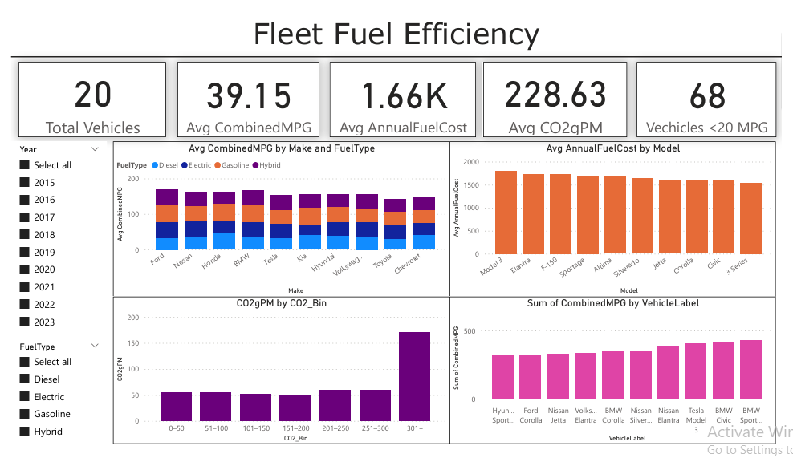

# 🚚 Fleet Fuel Efficiency Dashboard (Power BI)

This Power BI dashboard provides insights into the fuel consumption, emissions, and cost efficiency of a sample fleet of 500 vehicles. It's built using realistic vehicle data and focuses on actionable KPIs for fleet operations and sustainability.

---

## 📊 Key Features

- 📌 **Total & Average KPIs**: Fuel cost, MPG, CO₂ emissions
- 🧾 **Top 10 Least Efficient Vehicles** (Combined MPG)
- 🧯 **CO₂ Emission Distribution** with custom bins
- ⛽ **Fuel Efficiency by Make/Model**
- 🔍 **Dynamic Filtering** with slicers (Make, Year, Fuel Type)

---

## 📂 Files Included

| File | Description |
|------|-------------|
| `FleetFuelDashboard.pbix` | Main Power BI dashboard file |
| `Sample_Fleet_Fuel_Economy_500.xlsx` | Sample vehicle data |
| `snapshot.png` | Dashboard preview image |
| `README.md` | Project description (this file) |

---

## 📌 Tools Used

- Microsoft Power BI
- DAX for calculated columns/measures
- Excel for initial data formatting

---

## 🖼️ Preview



---

## 📈 Ideal Use Cases

- Fleet operations analytics
- Sustainability and emissions tracking
- Vehicle performance and fuel optimization
- Portfolio showcase for data analyst roles

---

## 🚀 Getting Started

1. Download or clone the repo:
   ```bash
   git clone https://github.com/yourusername/Fleet-Fuel-Dashboard.git
